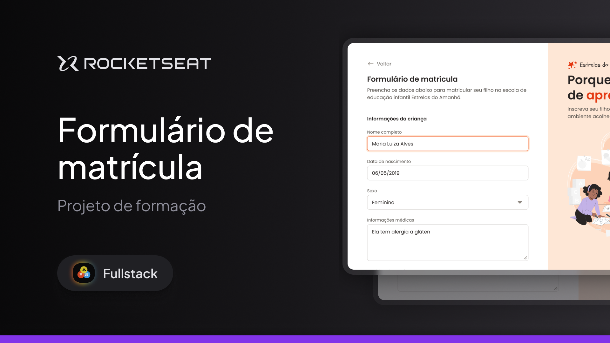

<h1 align="center">Formulário de matrícula</h1>

Programa feito no quadro do curso Full-Stack da Rocketseat.  

 

  
  Imagem feita por <a href="https://www.linkedin.com/in/ilanamallak/">Ilana Mallak</a>

## 🚀 Tecnologias

Esse projeto foi desenvolvido com as seguintes tecnologias:

- HTML e CSS
- Git e Github
- Figma

## 🖥️ Projeto

Neste projeto, desenvolvi um formulário para desktop voltado a uma escola de educação infantil.  
Este é um dos projetos desenvolvidos durante as aulas da formação Full-stack da Rocketseat.
